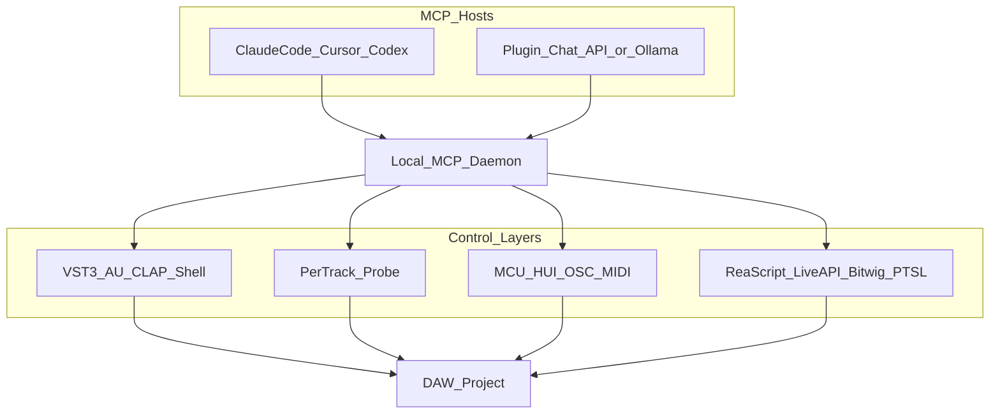
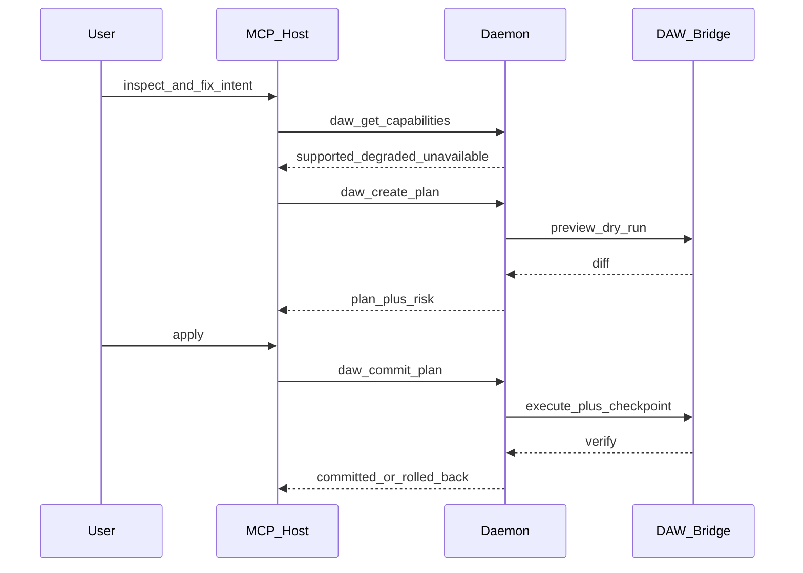

# DAW Agent Runtime：已鎖定決策與落地計畫

## 已鎖定的產品決策

- **Go-to-market**：雙路徑 MVP。同一套 Tool 層同時給（1）Claude Code / Cursor / Codex 當 MCP Server，（2）DAW 外掛內建 chat UI。
- **外掛格式**：C/C++ 殼，目標 **VST3 + AU + CLAP**（AAX 不進 P0）。macOS VST3/AU 先，CLAP 與 Windows 隨後。
- **深層控制範圍**：REAPER、Ableton Live、Bitwig、Logic Pro、Studio One、Pro Tools，以及後續 Cubase / FL Studio。不是「每套 DAW 同一張功能表」，而是 **統一 MCP ontology + 每套宿主 capability profile**。
- **訂閱零額外費用**：使用者在官方 Claude Code / Cursor / Codex 裡說話，本產品只當 MCP 後端。
- **外掛內建對話**：只接受使用者自己的 API key（Anthropic / OpenAI / OpenRouter）或本機 Ollama。不包 CLI、不讀 `~/.claude` / `~/.cursor`、不做 Claude.ai 登入。

## Grill 後仍成立的結論

方向對，但三件事不能綁成單一產品謊言：**跨 DAW MCP Tool 生態、VST3/AU/CLAP 感測器、零額外費用訂閱 LLM**。前兩件可行。第三件若做成外掛聊天視窗呼叫 `claude -p` 或攔截 session token，違反 Anthropic 2026 條款（訂閱 OAuth 不得進入第三方產品 / Agent SDK）。[Legal and compliance](https://code.claude.com/docs/en/legal-and-compliance)

**MCP Daemon 才是產品；Plugin 是 DAW 內的 sensor / MIDI endpoint / 可選 UI。**

護城河不是再包 180 個 REAPER-only tool（市場已有 [Reaper-MCP](https://github.com/xDarkzx/Reaper-MCP)、ReaAssist、Ableton MCP、[WigAI](https://github.com/fabb/WigAI)、[logic-pro-mcp](https://github.com/jdpersina/logic-pro-mcp)、[StudioOneMcp](https://github.com/tiwadara/StudioOneMcp)）。護城河是：統一 ontology、capability profile、Transaction / Preview / Rollback、外掛內 DSP 量測。

第一版只做 **Ask → Inspect → Explain → Preview → Apply → Undo**。

---

## 訂閱 vs API

- **API Mode（外掛 UI）**：Anthropic Messages、OpenAI-compat、OpenRouter、Ollama `http://localhost:11434`。Daemon 當 MCP Host。金鑰只進 OS keychain / 本機設定。
- **Subscription Mode**：`claude mcp add daw -- /path/to/daw-mcp`（stdio 或本機 Streamable HTTP）。Cursor / Codex 同理。
- **明確不做**：`claude -p` 當隱藏客戶端、攔截憑證、第三方 Claude.ai login、把 Pro/Max OAuth 轉進自己的對話迴圈。

---

## 四層控制

所有 tools 用同一組 `daw_*` 名稱。每個 tool 宣告所需 **control layer** 與 **risk level**。連線先呼叫 `daw_get_capabilities()`，回 `supported` / `degraded` / `unavailable` + 原因。不可用必須硬失敗並給下一步（插入 Probe、換 L3 宿主），禁止 silently no-op。

- **L0 Plugin Shell（全 DAW）**：當前軌 MIDI 讀寫、輸入 DSP（FFT、短窗 LUFS、phase、onset）、Audition buffer、外掛自身 checkpoint。JUCE `process()` 只走 preallocated buffer + SPSC queue。網路 / LLM / 磁碟全在 Daemon。P0 UI 用 JUCE 原生或 `WebBrowserComponent`，不做 CEF。
- **L1 Per-track Probe**：多軌插入輕量 Probe，Daemon 彙總頻譜/電平。Logic / Studio One / Cubase 做 masking 與 session health 的可靠路。
- **L2 Control Surface**：虛擬 MCU / HUI / OSC / MIDI command。transport、fader、mute/solo/arm。幾乎不能讀 MIDI clip、不能穩定插入第三方外掛。
- **L3 Native API**：REAPER ReaScript；Ableton Live API；Bitwig Controller API；Pro Tools PTSL。專案圖、routing、FX chain、render。

**P0 禁用**：ARA2、Accessibility 點擊、CGEvent 熱鍵。AX/CGEvent 最多當 Logic 的 `fragile` fallback，P2 才評估。

Risk：L0 READ 自動；L1 REVERSIBLE 先 checkpoint；L2 STRUCTURAL 必須 Preview；L3 DESTRUCTIVE 必須明確確認。MCP annotations（`readOnlyHint`、`destructiveHint`、`idempotentHint`）與內部 risk 對齊。

---

## 宿主深層控制（能力檔）

- **REAPER（P0，參考實作）**：Lua 常駐 + local TCP/UDS。枚舉軌、item、FX、參數、MIDI、send、render。驗證 ontology 的唯一第一宿主。特有能力放 `daw_reaper_*` 或 capabilities 擴充，不污染根層 tool 清單。
- **Ableton Live（P1）**：Live Object Model（Remote Script / Max for Live）。track / clip / device / mixer / transport。瀏覽器載入 device 常需自訂 script。不把 OSC 當唯一通道。
- **Bitwig Studio（P1）**：Java Controller Extension。mixer、device remote、clip launch、transport。維護成本低於 Logic hack。
- **Logic Pro（P2，降級深層）**：Scripter 只是 MIDI FX。AppleScript 只能讀部分 document。MCU + MMC + 有限讀路徑。沒有對等 `insert_plugin` / `create_sidechain`。跨軌分析靠 L0+L1 Probe。
- **Studio One / Fender Studio Pro（P2，降級深層）**：無公開專案 API。虛擬 MIDI 映射內建 command/macro + MCU。能觸發新增軌 / Split / Bounce，不能可靠讀完整 FX 參數圖。
- **Pro Tools（P2）**：官方 PTSL gRPC（約 2022.12+）。session / track / clip / transport / export。需 [Avid developer](http://developer.avid.com/scripting/) signup。不要用 HUI 假裝 PTSL。
- **Cubase / Nuendo（P3）**：MIDI Remote 沙盒 ES5。mixer / transport only。不能建軌、不能插 plugin、不能讀完整專案。
- **FL Studio（P3）**：Piano roll Python API。MIDI Copilot 可用，routing / mix graph 不可用。
- **其他**：Ardour 已有官方 MCP，不優先。DAWproject 只做離線 diff，不取代即時控制。

同一句「幫我看 session 有什麼問題」：REAPER 走 L3 列出軌與 FX；Logic 走 Probe+MCU，並明確寫「看不到其他軌的 plugin chain」。

---

## P0 MCP Tool 清單（根層，跨 DAW）

唯讀：

- `daw_get_capabilities`
- `daw_get_session_summary`（樹狀概覽，禁止一次倒完整 MIDI）
- `daw_list_tracks`（分頁 20–50）
- `daw_get_track` / `daw_fetch_track_detail`（按需深入）
- `daw_list_plugins`
- `daw_get_midi_selection`
- `daw_analyze_spectrum`
- `daw_analyze_loudness`
- `daw_health_check`

寫入（經 transaction）：

- `daw_create_plan` / `daw_preview_plan` / `daw_commit_plan` / `daw_rollback`
- `daw_write_midi`（L0 當前軌或 L3 clip）
- `daw_set_parameter`（僅 capabilities 為 supported）
- `daw_set_track_mute` / `daw_rename_track`（L3 或 L2 能做到才開放）
- `daw_set_playhead` / `daw_locate_marker`（能做到才開放）

長任務用 MCP Tasks 擴充 `io.modelcontextprotocol/tasks`；Host 不支援則 progress notification。禁止 `tools/call` 阻塞數十秒。

回傳同時給 structured JSON 與短 Markdown。列表一律分頁。

---

## MVP 五塊 vs 後續功能 backlog

P0 只做 AI Production Console：

1. Session Inspector + Health Check
2. MIDI Copilot（生成 / 轉調 / voice leading / groove fingerprint + Audition）
3. Mix Analyzer（建議參數；無 L3 時不偷偷轉 EQ）
4. Command Agent（只打 supported tools）
5. Transaction runtime

原 35 項對應（避免之後膨脹時失憶）：

- **P1**：Arrangement Doctor、section energy、plugin chain 解釋、automation composer、natural-language navigation、REAPER/Ableton project diff、reference 頻譜對比、CPU/latency inspect（僅 L3 宿主）
- **P2**：Mix Intent Compiler、routing graph debugger、semantic snapshot、preset embedding search、Probe 驅動的 masking 自動建議、Logic/Studio One/PT 降級深層
- **P3+**：Auto Comping、Recording punch assistant、Sound Design / Serum 計畫、Live Performance Agent、硬體 SysEx、Git-for-DAW 全量、8 個命名 Agent 外殼（底層仍共用同一 Tool 層）

**永不做**：把 LLM inference 放進 realtime audio path。

---

## 倉庫結構（目前是空 git repo）

- [`contracts/`](contracts/)：JSON Schema（tools、capabilities、snapshot、transaction）。唯一 source of truth。
- [`daemon/`](daemon/)：Go。stdio + `127.0.0.1` Streamable HTTP。Provider adapters。Plugin IPC。capability registry。transaction engine。
- [`plugin/`](plugin/)：JUCE C++。VST3/AU MIDI+analyzer；Probe 可為同一 binary 的變體。
- [`bridges/reaper/`](bridges/reaper/)：P0 Lua + socket。
- [`bridges/ableton/`](bridges/ableton/)、[`bridges/bitwig/`](bridges/bitwig/)：P1。
- [`bridges/logic/`](bridges/logic/)、[`bridges/studioone/`](bridges/studioone/)、[`bridges/protools/`](bridges/protools/)：P2。
- [`bridges/cubase/`](bridges/cubase/)、[`bridges/flstudio/`](bridges/flstudio/)：P3。
- [`eval/`](eval/)：10 題 read-only MCP eval，用 capabilities fixture，不依賴真的 100 軌工程。
- [`docs/`](docs/)：Claude Code / Cursor / Codex 連線、各 DAW 安裝 bridge、合規說明。

若 Go MCP SDK 卡住 Tasks 擴充，只把 protocol 層換成 TypeScript，Go 留 IPC 與之後的 DSP helper。外掛行程內不啟動 LLM。

IPC：macOS/Linux Unix Domain Socket，Windows Named Pipe，length-prefixed JSON-RPC。Plugin 連不上 Daemon 時只顯示「請啟動 daw-mcp」。

---

## 分階段交付

**P0**

- contracts + capability engine + 上列根層 tools
- daemon MCP + API/OpenRouter/Ollama + 合規連線文件
- JUCE L0（macOS VST3/AU）
- MIDI Copilot + 單軌 analyzer + transaction
- REAPER L3 bridge
- 測試：queue、capability matrix、rollback、provider adapter、audio-thread 靜態清單

**P1**

- Ableton + Bitwig native bridges
- Probe 多實例彙總
- L3 宿主上的缺檔 / unnamed / clipping health
- Tasks 或等價 progress

**P2**

- Logic MCU+AppleScript（degraded）
- Studio One MIDI command+MCU（degraded）
- Pro Tools PTSL
- Reference analyzer（plugin/probe 音訊）

**P3**

- Cubase / FL Studio 降級
- Arrangement / Automation / plugin-semantic

---

## 成功標準

- 同一自然語言請求在不同宿主回傳不同 capability 誠實說明，且不執行 unavailable tool。
- 外掛 chat 只能設定 API key / Ollama；Subscription 使用者只被導向官方 CLI 加 MCP。
- L2+ 寫入皆有 plan + checkpoint；測試可 rollback。
- Audio callback 無 alloc / 無 lock / 無網路。
- 根層沒有 180 個 REAPER-only tools。
